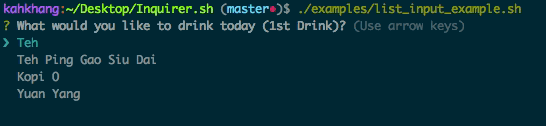
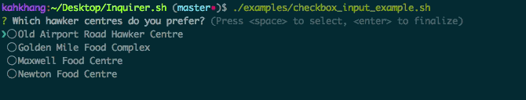
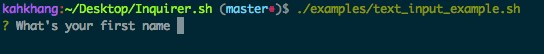

## :rocket: Inquirer.sh - Modern Terminal Prompt in Bash
[](https://github.com/tanhauhau/Inquirer.sh) [](https://raw.githubusercontent.com/tanhauhau/Inquirer.sh/master/LICENSE) [](https://twitter.com/intent/tweet?text=%23Inquirer.sh%20rocks%21&url=%5Bobject%20Object%5D)

A collection of common interactive command line user interfaces, written in bash. Inspired by [Inquirer.js](https://github.com/SBoudrias/Inquirer.js)

### List Input ([Example](https://github.com/tanhauhau/Inquirer.sh/blob/master/examples/list_input_example.sh))


```sh
Usage: list_input [prompt] [array] [selected_option]
Usage: list_input_index [prompt] [array] [selected_index]
```

### Checkbox Input ([Example](https://github.com/tanhauhau/Inquirer.sh/blob/master/examples/checkbox_input_example.sh))


```sh
Usage: checkbox_input [prompt] [array] [selected_options_output]
Usage: checkbox_input_indices [prompt] [array] [selected_indices_output]
```

### Text Input ([Example](https://github.com/tanhauhau/Inquirer.sh/blob/master/examples/text_input_example.sh))


```sh
Usage: text_input [prompt] [output_variable] [regex_string (Optional)] [failed_validation_prompt (Optional)] [validator_function (Optional)]
```

### [Contributors](https://github.com/tanhauhau/Inquirer.sh/blob/master/CONTRIBUTORS.md)
* [Andrew Low](https://github.com/kahkhang)
* [Tan Li Hau](https://github.com/tanhauhau)
