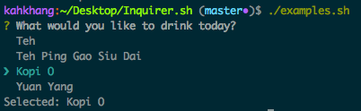
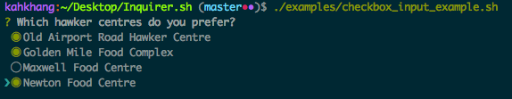
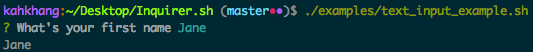

## Inquirer.sh

A collection of common interactive command line user interfaces, written in bash. Inspired by [Inquirer.js](https://github.com/SBoudrias/Inquirer.js)

### List Input


```sh
source list_input.sh

drinks=( 'Teh' 'Teh Ping Gao Siu Dai' 'Kopi O' 'Yuan Yang' )
list_input "What would you like to drink today?" drinks

print "Selected: ${drinks[$selected_index]}"
```

### Checkbox Input


**checkbox_input** *variable_name* *prompt* *options*

```sh
source checkbox_input.sh

hawker_centres=( 'Old Airport Road Hawker Centre' 'Golden Mile Food Complex' 'Maxwell Food Centre' 'Newton Food Centre' )

checkbox_input selected_indices "Which hawker centres do you prefer?" hawker_centres
echo "Selected indices $(join "${selected_indices[@]}")"
echo "Selected Hawker Centers:"
for i in $(seq 1 ${#selected_hawkers[@]}); do
  echo "${hawker_centres[${selected_hawkers[$i]}]}"
done
```

### Text Input


```sh
source text_input.sh

text_input "What's your first name" name
echo "$name"
```

### [License](https://github.com/tanhauhau/Inquirer.sh/blob/master/LICENSE)

### [Contributors](https://github.com/tanhauhau/Inquirer.sh/blob/master/CONTRIBUTORS.md)
